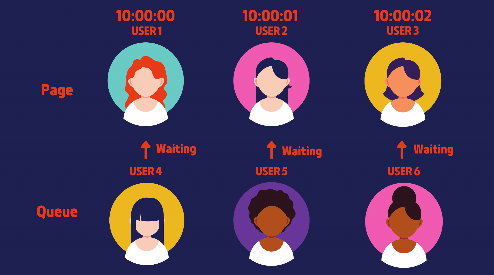

# TICKETCLUB

TICKETCLUB is a concert ticket-selling website that provides **queuing system**.

- Website Link: https://ticketclub.live/
- Frontend Repo: https://github.com/Claudia-teng/ticket-club
- Backend Repo: https://github.com/Claudia-teng/ticket-club
- Demo & Explanation Video: https://drive.google.com/file/d/14Ymsu-p7zLsXRVPCJwRd5a7_nN0MhaTr/view

# Content

- [Login](#login)
- [Tech Stack](#tech-stack)
- [Architecture Diagram](#architecture-diagram)
- [Features](#features)
- [Update Seat Status](#update-seat-status)
- [Queuing System](#queuing-system)
- [Load Test](#load-test)

## Login

- email: demo@test.com
- password: demodemo

Each account can only purchase 4 tickets per show. If the account reaches the limit, you can sign up a new account to purchase again.

## Tech Stack

- Frontend: React
- Backend: node.js, Express, Socket.IO
- Database: RDS(MySQL), Redis
- Cloud Service: EC2, S3, CloudFront, Elastic Load Balance, Auto Scaling, CloudWatch EventBridge, Lambda
- CD: GitHub Action, Docker, Code Deploy

## Architecture Diagram

## Features

- Limit the number of people visiting the event selling page to prevent server crashes.
- Apply "queuing psychology" and calculate the estimated waiting time for each user by using **WebSocket** and **Redis** List & Hash.
- Use **Elastic Load Balancing** and **Auto Scaling** to scale out servers.
- Use **CloudWatch EventBridge** to schedule **Lambda** to warm up instances before each selling event starts.
- Update seat status (selected, locked, sold) by WebSocket during selling time to reduce race conditions.
- Implement continuous deployment by **GitHub Actions, Docker, Code Deploy** to automatically update app versions across multiple instances.

## Update Seat Status

Tools: Socket.IO, MySQL Lock

- Update seat status immediately to avoid two users getting the same seat at the same time as mush as possible
- Use MySQL lock to ensure every seat can only be successfully selected by one user.

## Queuing System

- Limit the number of people visiting the event selling page to prevent server crashes.
- Apply "queuing psychology" and calculate the estimated waiting time for each user by using **WebSocket** and **Redis** List & Hash.

### How I implement queuing system?

Tool: Redis (List & Hash)

1. Use List to record the order of people entering ticket selling page.
2. Use Hash to record the timestamp of each user entering the ticket selling page.
3. If the number of people inside the page reaches the limit, another list will record the queuing order.
4. There is a 10-minute time limit for purchasing process. Use index to find the corresponding user that each queuing user should wait and calculate estimated waiting time.

For example:

If the limit of visiting ticket selling page is set to 3...

1. User 1 arrived, successfully get into ticket selling page.
2. User 2 arrived, successfully get into ticket selling page.
3. User 3 arrived, successfully get into ticket selling page.
4. User 4 arrived, failed to get into ticket selling page, placed in the 1th in queue.
5. User 5 arrived, failed to get into ticket selling page, placed in the 2nd in queue.
6. User 6 arrived, failed to get into ticket selling page, placed in the 3nd in queue.

**Calculate estimated waiting time**

1. User 4 need to wait for 1 person, and it's waiting time is (10 minutes - User 1's timestamp) + 10 seconds buffer.
2. User 5 need to wait for 2 people, and it's waiting time is (10 minutes - User 2's timestamp) + 10 seconds buffer.
3. User 6 need to wait for 3 people, and it's waiting time is (10 minutes - User 3's timestamp) + 10 seconds buffer.

**Scenario 1: User 1 completed a purchase**

1. Let the first user in queue (User 4) to get into the page.
2. Update waiting information for all users in queue.

- Update User 5's waiting info: wait for 1 person, waiting time is (10 minutes - User 2's timestamp).
- Update User 6's waiting info: wait for 2 person, waiting time is (10 minutes - User 3's timestamp).

**Scenario 2: User 4 left the queue**

1. Find Users queuing behind User 4, and update their waiting information.

- Update User 5's waiting info: wait for 1 person, waiting time is (10 minutes - User 1's timestamp).
- Update User 6's waiting info: wait for 1 person, waiting time is (10 minutes - User 2's timestamp).

**Scenario 3: User 2 left the page without buying**

1. Let the first user in queue (User 4) to get into the page.
2. Update waiting information for all users in queue.

- Update User 5's waiting info: wait for 1 person, waiting time is (10 minutes - User 1's timestamp).
- Update User 6's waiting info: wait for 1 person, waiting time is (10 minutes - User 2's timestamp).

## Load Test

Concert ticket selling website must be capable of handling high traffic.

I use websocket to confirm if a user is still in page or in queue, so I implemented a load test to check the max socket connections with both horizontal and vertical scaling and compared two scaling results & costs.

Code: https://github.com/Claudia-teng/ticket-club-load-test/blob/main/connection-time.js

### Horizontal Scaling

I used t3.micro to observe the connection growth as more instances added. The connections have increased but the did not exactly doubled from 30,000 to 60,00 if a new instance added.

### Vertical Scaling

By upgrading the instance type from t3.micro to t3.small, the max connections has increased more than one time from 30,000 to 80,000.

### Comparison

Assuming the goal is to provide 80,000 stable socket connections, if the instances run for 30 days, vertical scaling has a better performance with a lower cost.

